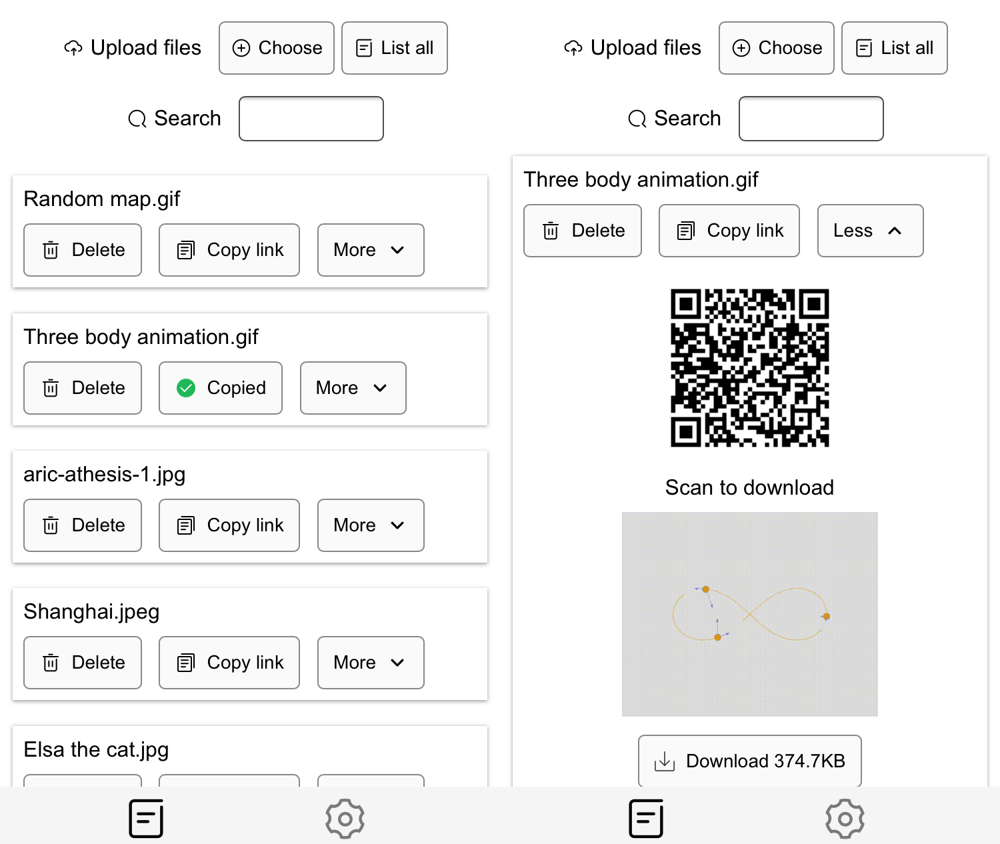

## Easy Share

Share files with ease




#### Config
0. Front
```js
    const app = Vue.createApp({
        data() {
            return {
            reqArgs: {
                // Set the right url
                // urlBase: "http://localhost:3000",
                urlBase: "https://arno.fun",
                password: "",
                username: "",
            },
```
0. Back
```ts
    // src/config.ts
    // Set the right url
```

#### API List

##### GET /

- Request

  ```url
  http://localhost:3000/
  ```

- Respond: Home page


##### POST /api/v1/file/list-all

- Request

    ```js
    {
        method: 'post',
        mode: 'cors',
        body: FormData {
            code: "hash of password"
        }
    }
    ```

- Respond: A file list which looks like this

    ```json
    [
        {
            "md5": "aa8eb4ea24241a1ba4ae227b0edd27d4",
            "filename": "IMG_1489.png",
            "md5WithExten": "aa8eb4ea24241a1ba4ae227b0edd27d4.png"
        }
    ]
    ```


##### POST /api/v1/file/upload

Upload a file

- Request

  ```js
  {
      method: 'post',
      mode: 'cors',
      body: FormData {
          code: "hash of password",
          chunkData: Blob {size: 759177, type: ""},
          chunkId: "0-aa8eb4ea24241a1ba4ae227b0edd27d4.png",
          filename: "IMG_1489.png",
          md5: "aa8eb4ea24241a1ba4ae227b0edd27d4",
          md5WithExten: "aa8eb4ea24241a1ba4ae227b0edd27d4.png"
      }
  }
  ```

- Respond

  success

  ```json
  {
      success: true,
      msg: "File saved 0-aa8eb4ea24241a1ba4ae227b0edd27d4.png",
      chunkId: "0-aa8eb4ea24241a1ba4ae227b0edd27d4.png"
  }
  ```

  fail

  ```json
  {
      success: false,
      msg: "Save file failed 0-aa8eb4ea24241a1ba4ae227b0edd27d4.png",
      chunkId: "0-aa8eb4ea24241a1ba4ae227b0edd27d4.png"
  }
  ```

  

##### POST /api/v1/file/merge

Ask the server to merge a file

- Request

  ```js
  {
      method: 'post',
      mode: 'cors',
      body: FormData {
          code: "hash of password",
          filename: "IMG_1489.png",
          chunkSize: 10 * 1024 * 1024 // 10MB
          md5: "aa8eb4ea24241a1ba4ae227b0edd27d4",
          md5WithExten: "aa8eb4ea24241a1ba4ae227b0edd27d4.png"
      }
  }
  ```

- Respond

  success

  ```json
  {
      success: true,
      msg: "Slices merge success IMG_1489.png",
      filename: "IMG_1489.png"
  }
  ```

  fail

  ```json
  {
      success: false,
      msg: "Slices merge failed IMG_1489.png",
      filename: "IMG_1489.png"
  }
  ```

  

##### GET /api/v1/file/:md5

- Request

  simply visit

  ```url
  http://localhost:3000/api/file/:aa8eb4ea24241a1ba4ae227b0edd27d4
  ```

- Respond

  A file will be returned


##### DELETE /api/v1/file/:md5

- Request

  ```js
  {
      method: 'delete',
      mode: 'cors',
      body: FormData {
          code: "hash of password"
      }
  }
  ```

- Respond

  success

  ```json
  {
      success: true,
      msg: "Successfully delete aa8eb4ea24241a1ba4ae227b0edd27d4.png"
  }
  ```

  fail

  ```json
  {
      success: false,
      msg: "delete failed aa8eb4ea24241a1ba4ae227b0edd27d4.png"
  }
  ```

  
